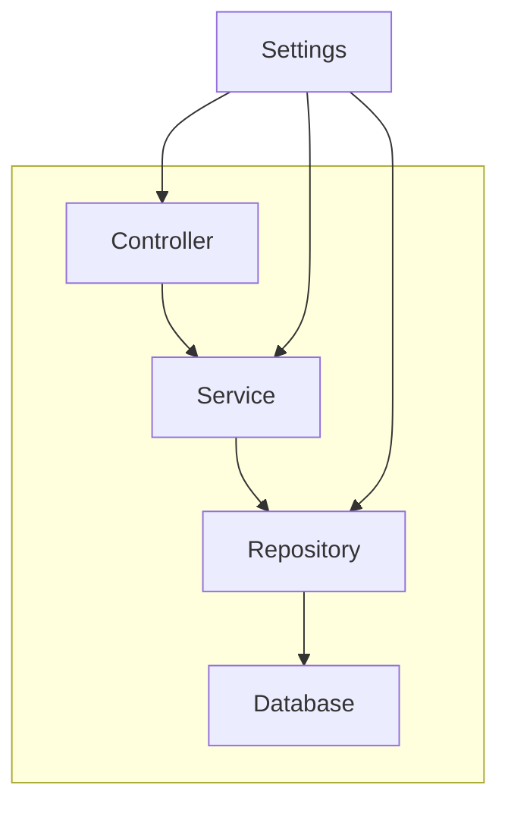
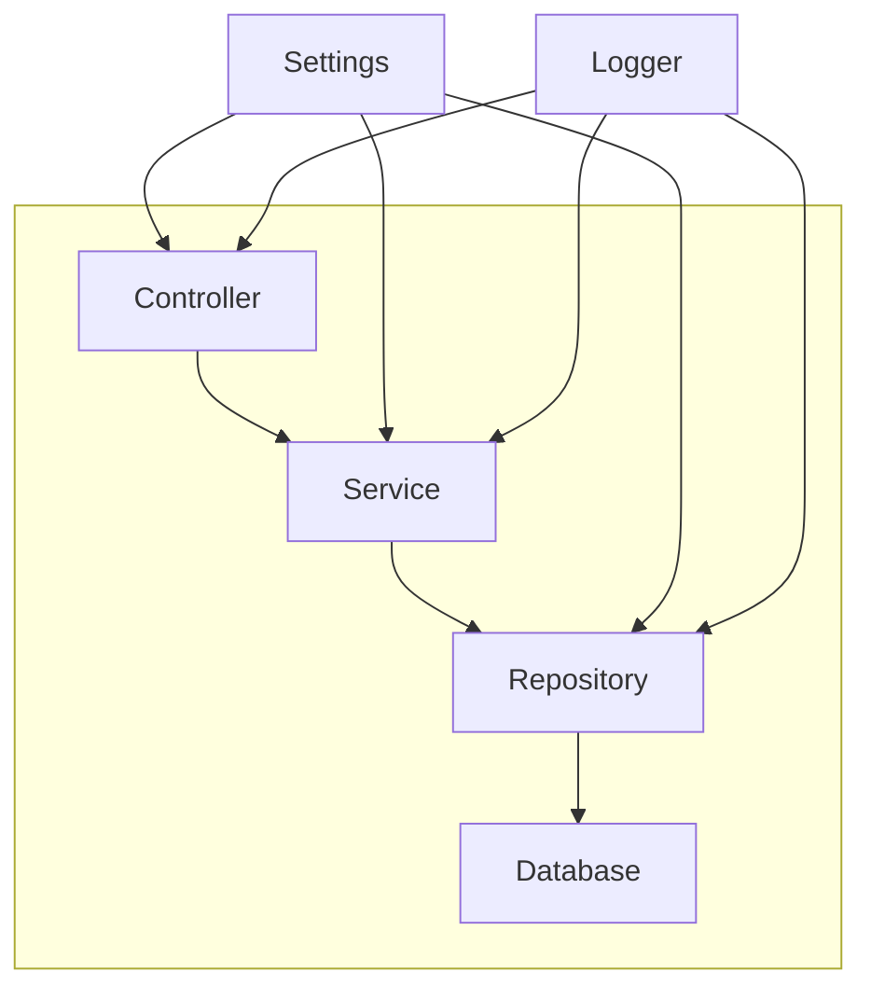

FastAPI has a wonderful Dependency Injection (DI) system that works reasonably well at the controller level.
However, to build a robust and testable application, it is helpful to make use of a dependency injection chain that spans multiple layers of the application.
This approach not only promotes a clean architecture but also significantly improves the test situation.

## Starting Point

Typically, a FastAPI application consists of a controller layer (the FastAPI endpoints), a service layer and often a repository layer.
While FastAPI provides a way to inject dependencies into the controller layer, it does not provide a way to inject dependencies into the service or repository layers.

But this does not mean that we cannot use dependency injection across multiple layers.
By building a dependency injection chain that spans multiple layers, we can inject dependencies into the service and repository layers as well.

Let's see how we can do this and get our hands dirty with some code.

A typical application might look like this:


But often we have application settings that might be used across the application in all layers, which let the application look like this:




Sometimes we also have a logger that we want to inject into all layers:



And many more dependencies might be possible.
Some of them could be shared across all layers, some of them might be shared only between some layers, and some of them might be specific to a single layer.

## Building the Dependency Injection Chain

To build a dependency injection chain that spans multiple layers, we can use Python's `Annotated` type and the `Depends` class from FastAPI.

Let's start by defining a `Settings` class that holds our application settings by inheriting from Pydantic `BaseSettings` class.
This helps to ensure that the settings are correctly typed and validated and can be easily injected into other classes.
*(Also it helps to load the settings from environment variables or configuration files, which is typically why I like to use it in my applications.)* 😉

```python
# file: settings.py
from pydantic import BaseSettings

class Settings(BaseSettings):
    app_name: str = "My App"
    db_connection_string: str = "sqlite:///:memory:"
    debug: bool = False
```

Next, let us define the three layers of our application: the controller, service, and repository layers.

The repository layer is responsible for fetching data from the database.
In this example, we will keep it simple and return some sample data.
In a real-world application, this would be a database query, often by using an ORM like SQLAlchemy.

```python
# file: repository.py
class Repository:
    def __init__(self, settings: Settings, db: Database):
        self.settings = settings
        self.db = db   # just to show that we can inject multiple dependencies

    def get_sample_data(self):
        # usually this would be a database query
        return [{"name": "Alice"}, {"name": "Bob"}]
```

Note that we have not used FastAPI's `Depends` here.
This is because the repository layer is not controlled by FastAPI.
Instead we will inject the `Settings` and `Database` objects into the repository layer by using the normal dependency injection pattern, meaning we will pass them as arguments to the constructor.

The service layer is responsible for business logic.
In this example, we will keep it simple and return the application name in uppercase.

```python
# file: service.py
from fastapi import Depends

class Service:
    def __init__(self, settings: Settings, repository: Repository):
        self.repository = repository

    def app_name_upper(self):
        return self.settings.app_name.upper()

    def get_sample_data_with_upper_names(self):
        data = self.repository.get_sample_data()
        return [{"name": item["name"].upper()} for item in data]
```

Before we define the controller layer, let us write the dependency injection functions which FastAPI will use to inject the dependencies into the service and repository layers.
These functions are needed by the FastAPI dependency injection system to resolve the dependencies.
Their purpose is to instantiate the objects.
[FastAPI allows to let dependencies depend on other dependencies](https://fastapi.tiangolo.com/tutorial/dependencies/#simple-and-powerful), which allows to build a dependency chain.

```python
# file: dependencies.py
from typing import Annotated

from myapp.settings import Settings
from myapp.database import Database
from myapp.repository import Repository

def get_settings():
    """Returns the application settings."""
    return Settings()

def get_service(settings: Annotated[Settings, Depends(get_settings)]):
    """Returns the service layer."""
    return Service(settings)

def get_repository(settings: Annotated[Settings, Depends(get_settings)], db: Annotated[Database, Depends(get_db)]):
    return Repository(settings, db)

def get_db(settings: Annotated[Settings, Depends(get_settings)]):
    """Returns the database connection."""
    return Database(connection_string=settings.db_connection_string).connect()

```

Finally, we define the controller layer, which consists of the FastAPI endpoints.
We inject the `Service` class into the controller layer using the `Depends` class from FastAPI.

Note that we do not need to inject the `Repository` class into the controller layer because it is already injected into the `Service` class, which is then injected into the controller layer.
Also there is no need to retrieve and pass the database connection to the service, because the repository is responsible for that.

FastAPI will automatically resolve the dependency chain and resolve the dependencies in the correct order.

```python
# app.py
from fastapi import FastAPI
from typing import Annotated

from myapp.dependencies import get_service

app = FastAPI()

@app.get("/")
def read_root(service: Annotated[Service, Depends(get_service)]):
    return {"app_name": service.app_name_upper()}

@app.get("/sample_data")
def read_sample_data(service: Annotated[Service, Depends(get_service)]):
    return service.get_sample_data_with_upper_names()
```

Note that from the controller layer, we only inject the `Service` class.
If needed, we could also inject the `Settings` class or any other dependencies that are meant to be used in all layers.
But there is no need to inject the `Repository` class or the `Database` class into the controller layer!

## Testing

This significantly simplifies testing.

For example, to test the `Service` class, we can easily mock the `Repository` class and the `Settings` class.
This is generally possible because of the dependency injection pattern we have used for initializing the `Service` class.

```python
# test_service.py
from myapp.service import Service
from myapp.repository import Repository
from myapp.settings import Settings

class MockSettings(Settings):
    app_name = "My App under test"

class MockRepository(Repository):
    def get_sample_data(self):
        return [{"name": "Alice"}, {"name": "Bob"}]

def test_app_name_upper():
    service = Service(MockSettings(), MockRepository())
    assert service.app_name_upper() == "MY APP UNDER TEST"
```

But the real power of this approach becomes apparent when testing the controller layer.

Because we have used the `Depends` class from FastAPI to inject the `Service` class into the controller layer and have configured everything as a dependency chain, we can easily override the dependency injection functions to inject mock objects at any level.

The following example shows how to override the `get_repository` function to inject a `MockRepository` object into the controller layer.

```python
# test_controller.py
from fastapi.testclient import TestClient

from myapp.app import app
from myapp.repository import Repository
from myapp.dependencies import get_settings, get_repository

class MockRepository(Repository):
    def get_sample_data(self):
        return [{"name": "Foo"}, {"name": "Bar"}]

def mock_get_repository(settings: Annotations[Settings, Depends(get_settings)]):
    # Return a mock repository instead of the real one.
    # Also, we don't need the database connection here, so we can pass None.
    return MockRepository(settings, None)

def test_read_root():
    # Arrange
    # Override any dependencies that need to be mocked
    app.dependency_overrides[get_repository] = mock_get_repository

    client = TestClient(app)

    # Act
    response = client.get("/sample_data")

    # Assert
    assert response.status_code == 200
    assert response.json() == [{"name": "FOO"}, {"name": "BAR"}]
```

This approach allows us to easily test the controller layer in isolation by mocking the service and repository layers.


## Vizualizing the Dependency Injection Chain

If the application is more complex and has more dependencies, it can be helpful to visualize the dependency injection chain.
Unfortunately I was not able to find a tool that can automatically generate a diagram from the code, so I wrote a Python library that can do this and published it on PyPI as an open-source project.

The library works by inspecting the application code and generating a graph in the DOT language, which can then be rendered to an image using Graphviz.
Alternatively the library provides to output mermaid diagrams, which can be used in markdown files, e.g., on GitHub.

The library is called [fastapi-di-viz](https://pypi.org/project/fastapi-di-viz/) and can be installed into a project with `pip install fastapi-di-viz`.
It provides a CLI tool that allows to inspect any FastAPI application.
See the [README](https://github.com/dotcs/fastapi-di-viz/) for more details on how this works.
